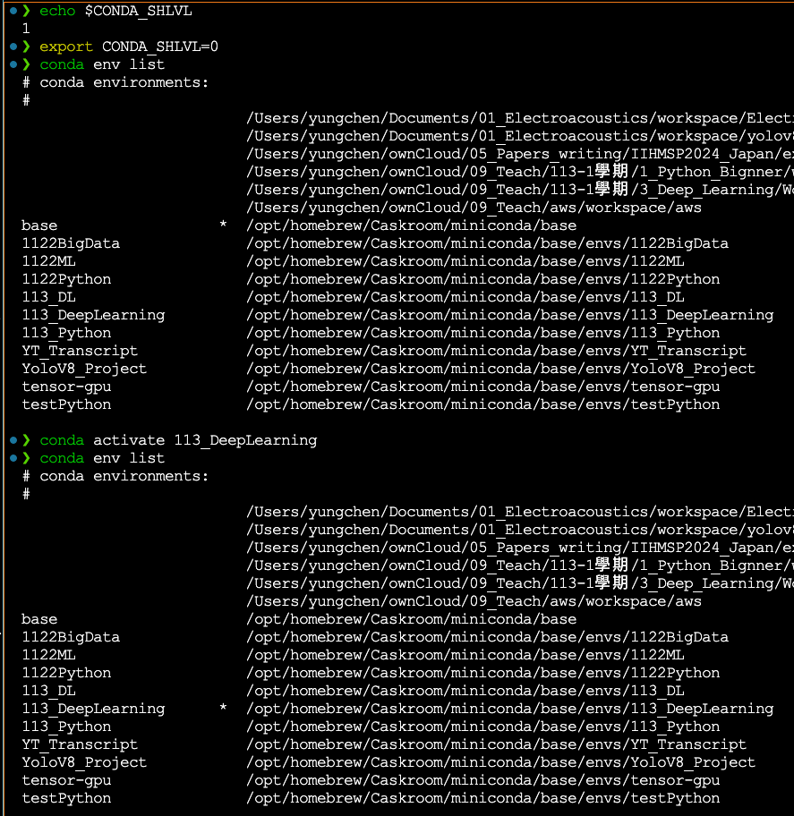

# Deep-Learning

### [1D CNN](1D_CNN.md)
### [2D CNN](2D_CNN.md)
### [RNN](RNN.md)


## Memo
---
在 Mac 環境下使用 minconda 建立 environment, 又曾裝過在 Mac M1/M2/M3 系列上用的 GPU 套件，使得始終在 VS Code 的終端機下無法成功使用 conda 建的 environment 此時可用下列指令查看現在的環境狀態，如果輸出不是 0 就無法啟動 conda 的 Environment
```
echo $CONDA_SHLVL 
```

網路爬文後得到的解決方法是將 $CONDA_SHLVL 這個變數的值變成0，再啟用 conda 的 environment 就可以了。

```
export CONDA_SHLVL=0
```

